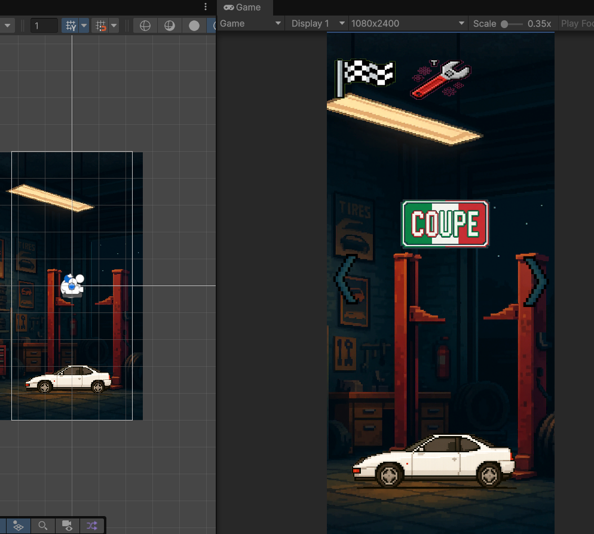
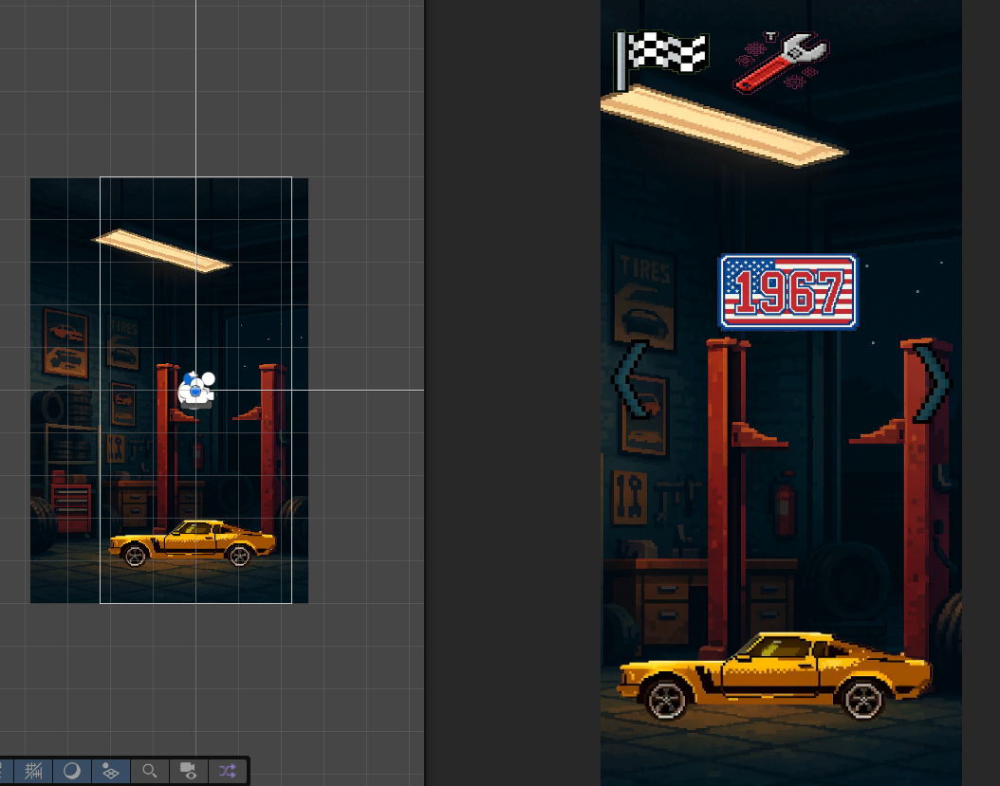
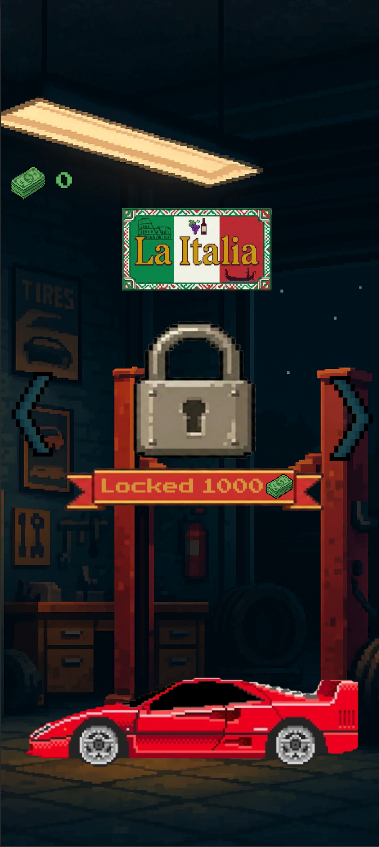
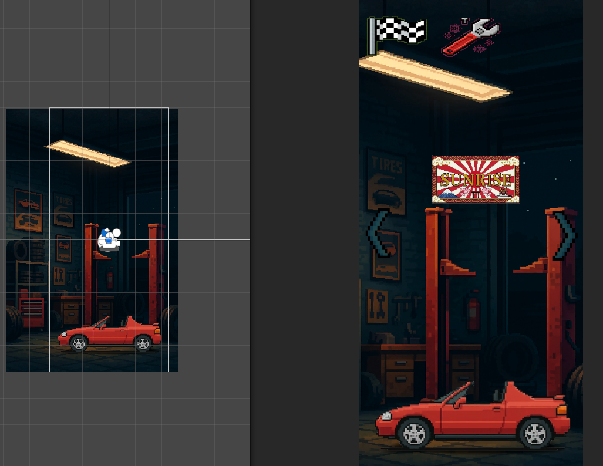
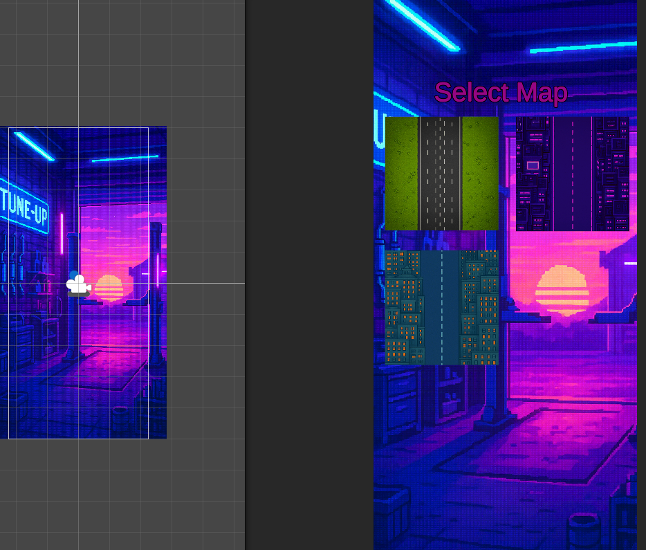
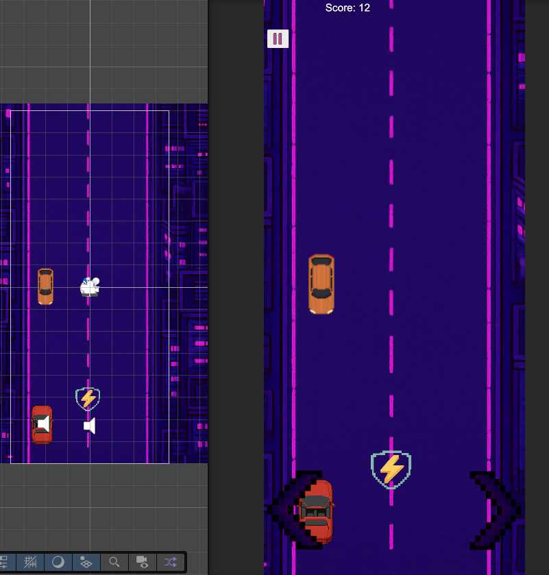
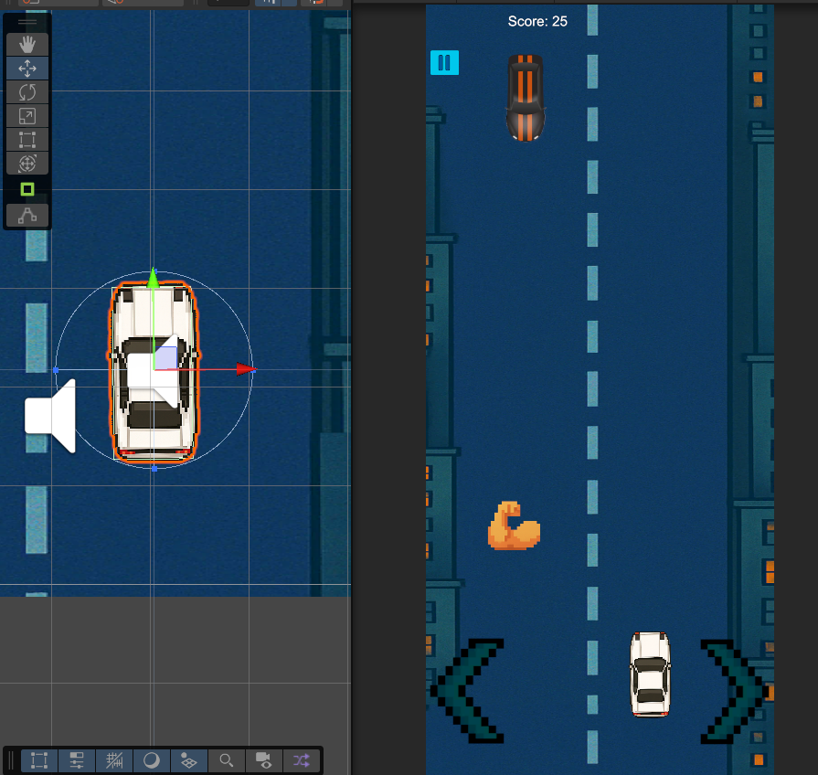
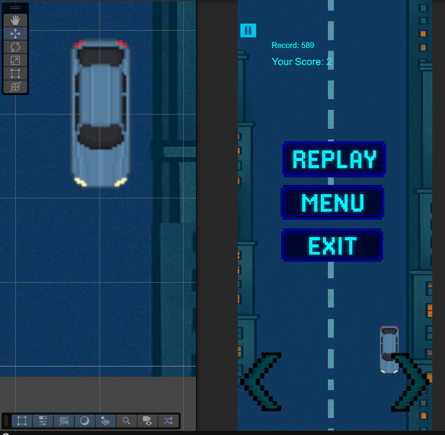

# 🏎️ Escape Lane

> **Dynamiczna gra arcade na system Android**, stworzona w Unity. Łączy klasyczny styl pixel art z prostą, wciągającą rozgrywką mobilną.

---

## 📸 Screeny z Gry

### 🏎️ Garaż i wybór pojazdów
| Garaż - Coupe | Garaż - 1967 | Garaż - La Italia | Garaż - Solaris |
| :---: | :---: | :---: | :---: |
|  |  |  |  |

### 🎮 Gameplay i Mechaniki
| Wybór Mapy | Night City | System Power-upów | Interfejs Gameover |
| :---: | :---: | :---: | :---: |
|  |  |  |  |
---

## 🚀 O Projekcie
Projekt to endless runner, w którym zadaniem gracza jest omijanie przeszkód i zbieranie ulepszeń na różnych trasach. Gra została zaprojektowana z myślą o urządzeniach mobilnych, oferując intuicyjne sterowanie i dynamiczną akcję.

### Główne Funkcje:
* **System Personalizacji:** Pełny garaż z różnymi modelami aut (Coupe, Muscle Car, Supercar) i systemem wyboru map.
* **Mechanika Power-upów:** System mnożników punktów (2x), tarcz ochronnych oraz ulepszeń siły.
* **Zaawansowany Input Handling:** Responsywne sterowanie dotykowe zaprojektowane pod urządzenia mobilne.
* **Dynamiczna Trudność:** System punktacji zapisujący rekordy (Highscore) i zwiększający wyzwanie wraz z czasem gry.

## 🛠️ Zaplecze Techniczne (Tech Stack)
W projekcie skupiłem się na czystości kodu i wydajności mobilnej:
* **Silnik:** Unity
* **Język:** C#
* **Optymalizacja:** Implementacja **Object Poolingu** (dla przeszkód i efektów), co znacząco redukuje obciążenie procesora na telefonach.
* **UI/UX:** W pełni responsywny interfejs użytkownika

## 📥 Pobierz i Przetestuj
Możesz przetestować grę bezpośrednio na swoim telefonie z Androidem:
👉 **[Pobierz plik .apk z sekcji Releases](https://github.com/Daniel321W/Escape-Lane/releases/download/1.0/Escape.Lane.apk)**

---

**Daniel321W** | [LinkedIn](https://www.linkedin.com/in/daniel-kozak-4a9733289) | [GitHub](https://github.com/Daniel321W)
