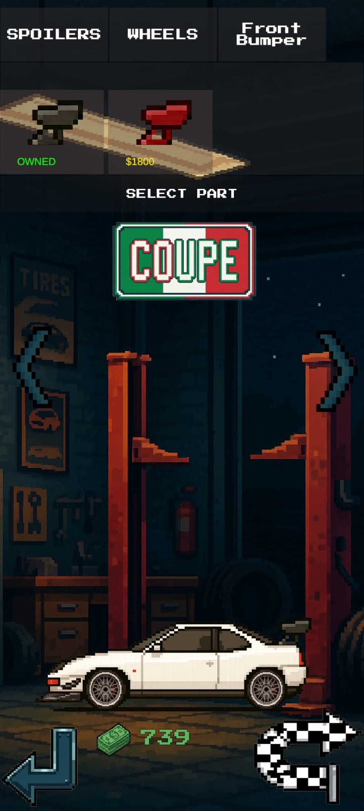
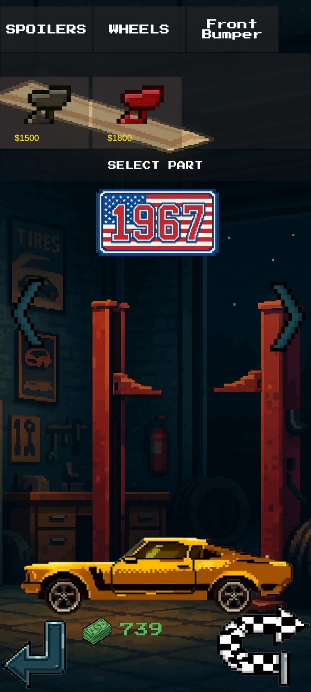
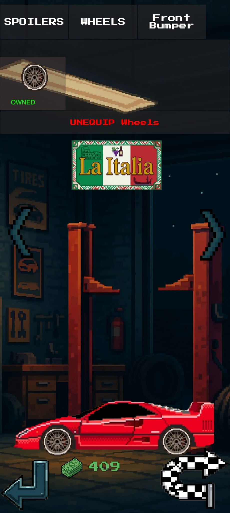
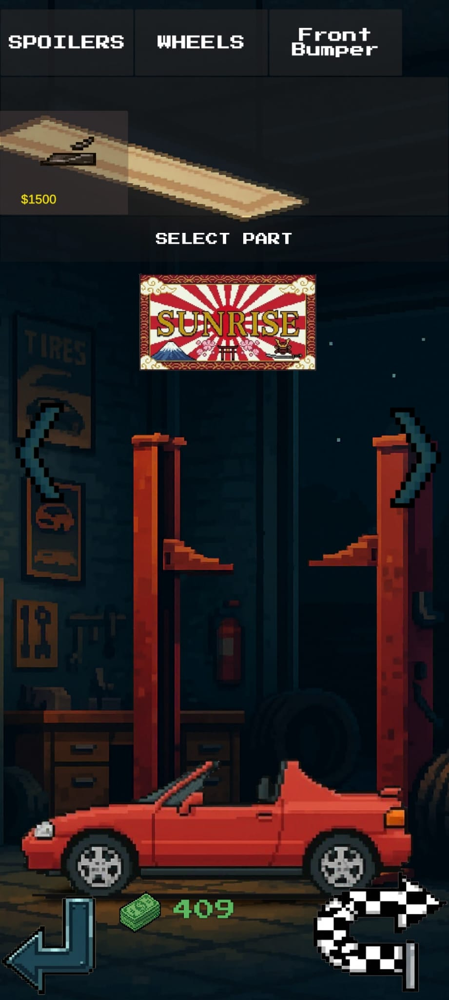
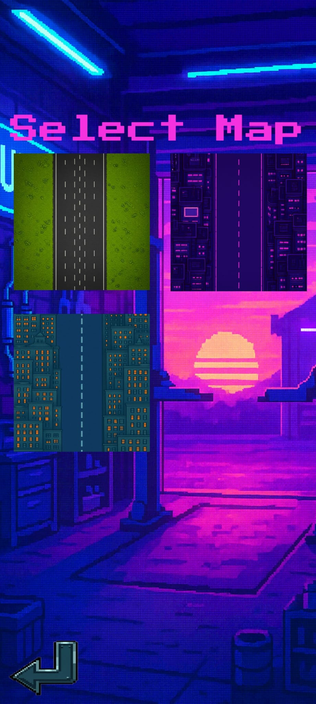
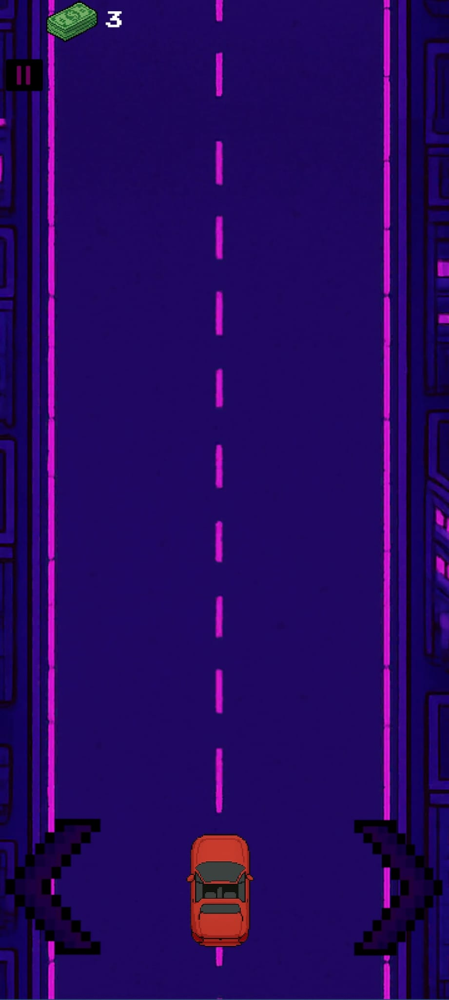
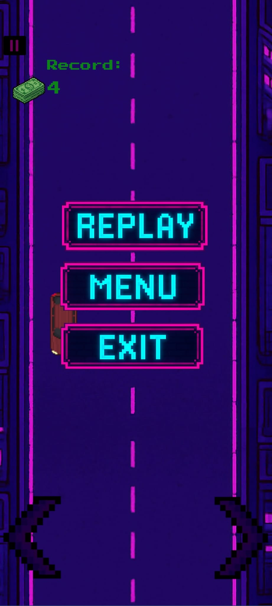

# 🏎️ Escape Lane

**Escape Lane** to dynamiczna gra typu endless runner na system Android, stworzona w silniku Unity. Projekt łączy klasyczną estetykę pixel art z rozbudowaną mechaniką tuningu pojazdów oraz systemem ryzykownej jazdy .

---

## 📸 Screeny z Gry

### 🏎️ Garaż i personalizacja
| Coupe | 1967 Muscle | La Italia | Solaris |
| :---: | :---: | :---: | :---: |
|  |  |  |  |

### 🎮 Gameplay
| Wybór Mapy | Night City | System Power-upów | Interfejs Gameover |
| :---: | :---: | :---: | :---: |
|  |  |  |  |

---

## 🚀 O Projekcie
**Escape Lane** to projekt, w którym kluczem do sukcesu nie jest tylko prędkość, ale precyzja. Gracz zarządza własną flotą samochodów, modyfikuje ich wygląd w garażu i stara się zdobyć jak najlepszy wynik na autostradzie, wykorzystując mechanikę "Near Miss".

### Kluczowe funkcje:
* **Zaawansowany System Tuningu:** Możliwość wymiany spoilerów, zderzaków i felg w garażu każdy model auta można spersonalizować.
* **Mechanika "Near Miss":** Dynamiczny system stref (Danger, Close, Far), który nagradza gracza mnożnikami punktów za precyzyjne wyprzedzanie aut przeciwników.
* **Ekonomia w grze:** Zintegrowany system waluty – zarabiaj podczas jazdy i inwestuj w nowe pojazdy oraz tuning.
* **Power-upy:** Dopalacze, tarcze ochronne i destrukcyjne bonusy, które urozmaicają rozgrywkę.
* **Responsywne Sterowanie:** System dotykowy zoptymalizowany pod kątem płynnej rozgrywki mobilnej.

## 🛠️ Zaplecze Techniczne (Tech Stack)
* **Silnik:** Unity
* **Język:** C#
* **Optymalizacja:** * Implementacja **Object Poolingu** dla obiektów tras i przeszkód.
    * Zaawansowany system detekcji kolizji (Layer-based Trigger Detection).
* **Zarządzanie stanem:** Wykorzystanie `PlayerPrefs` do trwałego zapisu stanu garażu, odblokowanych części oraz ekonomii.

## 📥 Pobierz i Przetestuj
Chcesz sprawdzić, czy dasz radę utrzymać mnożnik x2.0 przez cały przejazd? Pobierz najnowszą wersję .apk:

👉 **[Pobierz Escape Lane .apk](https://github.com/Daniel321W/Escape-Lane/releases/download/1.0/Escape.Lane.apk)**

---

## 👨‍💻 Autor
**Daniel EngineToEngine**
* [LinkedIn](https://www.linkedin.com/in/daniel-kozak-4a9733289)
* [GitHub](https://github.com/Daniel321W)

*Projekt jest w ciągłym rozwoju. Jeśli napotkasz błędy lub masz sugestie, daj znać przez Issues!*
